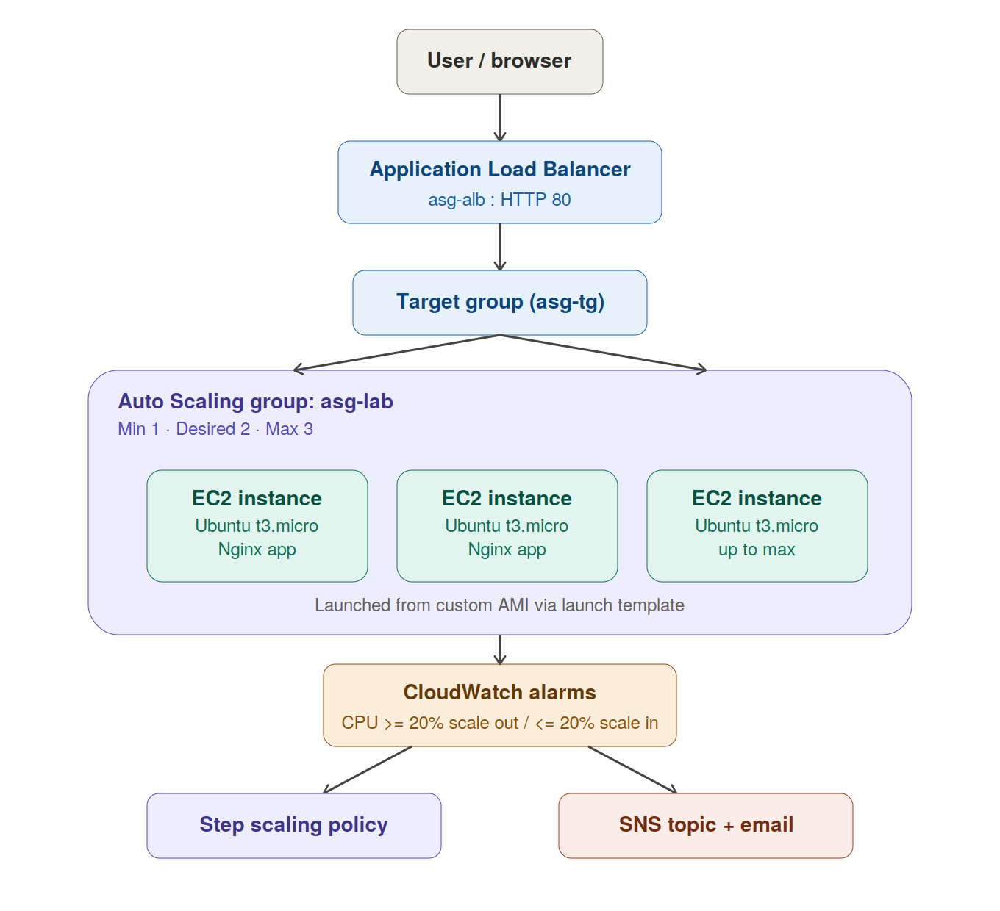

# AWS Auto Scaling Lab — EC2, AMI, ALB, and CloudWatch-Driven Scaling

This repository documents a hands-on AWS lab that deploys a simple web application on EC2, packages it into a custom AMI, and uses that AMI to run an Auto Scaling Group (ASG) behind an Application Load Balancer (ALB). CPU-based CloudWatch alarms trigger scale-out and scale-in actions, with SNS email notifications for every alarm state change.

## Architecture



**Traffic flow:** User → Application Load Balancer → Target Group → EC2 instances (Auto Scaling Group, launched from a custom AMI)

**Scaling flow:** CloudWatch CPU alarms → Step scaling policy → Auto Scaling Group adds/removes instances → SNS topic emails the user on every alarm state change

## Stack used in this lab

| Component | Choice |
|---|---|
| OS | Ubuntu Server 24.04 LTS |
| Instance type | t3.micro |
| Web server | Nginx (static Hello World page) |
| Load balancer | Application Load Balancer (internet-facing) |
| Scaling | Step scaling policy, CPU threshold 20% |
| Notifications | SNS topic subscribed by email |
| Load generator | `stress` (CPU load) |

## Prerequisites

- An AWS account with permissions for EC2, Auto Scaling, ELB, CloudWatch, and SNS
- A key pair for SSH access (create one in EC2 → Key Pairs, or during instance launch)
- Basic familiarity with the AWS Management Console

---

## Step 1 — Launch a base EC2 instance

1. Go to **EC2 → Instances → Launch instance**
2. Configure:
   - **Name:** `asg-based-web-app`
   - **AMI:** Ubuntu Server 24.04 LTS, amd64
   - **Instance type:** `t3.micro`
   - **Key pair:** select or create one, e.g. `autoscaling-lab-key`
   - **Security group:** create a new one, e.g. `asg-lab-sg`, with inbound rules:
     - SSH (22) — your IP only
     - HTTP (80) — will be scoped to the ALB's security group later (see Step 9)
   - **Storage:** default 8 GiB gp3
3. Click **Launch instance** and wait for it to reach the `running` state.

## Step 2 — Deploy the application

SSH into the instance using its public IP or public DNS:

```bash
ssh -i autoscaling-lab-key.pem ubuntu@<public-ip>
```

Install Nginx and the tools you'll need later for load testing:

```bash
sudo apt update -y
sudo apt install -y nginx apache2-utils stress
```

Create a simple Hello World page that also reports the instance ID (useful for confirming load balancing works):

```bash
INSTANCE_ID=$(curl -s http://169.254.169.254/latest/meta-data/instance-id)
sudo tee /var/www/html/index.html > /dev/null <<EOF
<html>
<head><title>Lab App</title></head>
<body style="font-family:sans-serif;text-align:center;margin-top:100px;">
  <h1>Hello World from Auto Scaling Lab!</h1>
  <p>Served by instance: <b>${INSTANCE_ID}</b></p>
</body>
</html>
EOF
sudo systemctl enable nginx
sudo systemctl restart nginx
```

Verify the app works by visiting `http://<public-ip>` in a browser — you should see the Hello World page.

## Step 3 — Create a custom AMI

1. **EC2 → Instances** → select your instance
2. **Actions → Image and templates → Create image**
3. Fill in:
   - **Image name:** `asg-lab-ami`
   - **Reboot instance:** checked (ensures filesystem consistency in the snapshot)
4. Click **Create image**
5. Wait for the AMI status to become `available` under **EC2 → Images → AMIs**

## Step 4 — Create a Launch Template

1. **EC2 → Launch Templates → Create launch template**
2. Configure:
   - **Name:** `asg-lab-lt`
   - **AMI:** `asg-lab-ami` (My AMIs)
   - **Instance type:** `t3.micro`
   - **Key pair:** `autoscaling-lab-key`
   - **Subnet:** leave as **"Don't include in launch template"** — subnet selection is handled by the ASG so it can spread instances across multiple Availability Zones
   - **Security group:** `asg-lab-sg`
   - Leave all Advanced details at their defaults
3. Click **Create launch template**

## Step 5 — Create the Auto Scaling Group (with ALB attached)

1. **EC2 → Auto Scaling Groups → Create Auto Scaling group**
2. **Name:** `asg-lab`
3. **Launch template:** `asg-lab-lt`
4. **Network:** select your VPC and **at least 2 subnets in different Availability Zones** — this is required for the ALB
5. **Load balancing:** choose **Attach to a new load balancer**
   - Type: **Application Load Balancer**
   - Name: `asg-alb`
   - Scheme: **Internet-facing**
   - Listener: HTTP : 80
   - Target group name: `asg-tg`
6. **Health checks:** enable **Turn on Elastic Load Balancing health checks** (in addition to the default EC2 health check)
7. **Group size:**
   - Desired capacity: **2**
   - Minimum capacity: **1**
   - Maximum capacity: **3**
8. **Scaling policies:** select **No scaling policies** for now — these are configured explicitly in Step 7
9. **Monitoring:** enable **Group metrics collection within CloudWatch**
10. Review and click **Create Auto Scaling group**

Wait a few minutes for both instances to launch and register as healthy in the target group.

## Step 6 — Verify the Load Balancer

1. **EC2 → Load Balancers → asg-alb** — note the **DNS name**
2. Visit `http://<alb-dns-name>` in a browser — you should see the Hello World page
3. **EC2 → Target Groups → asg-tg → Targets** tab — confirm both instances show `healthy`

## Step 7 — Set up SNS email notifications

1. **SNS → Topics → Create topic**
   - Type: Standard
   - Name: `asg-notifications`
2. **Create subscription**
   - Protocol: Email
   - Endpoint: your email address
3. Check your inbox and **confirm the subscription** — required before any notifications will actually arrive

## Step 8 — Create CloudWatch alarms and scaling policies

> **Note on metric scoping:** point alarms at the specific EC2 instance's per-instance `CPUUtilization` metric (EC2 → Per-Instance Metrics) rather than an `AutoScalingGroupName`-dimensioned metric. In testing, the ASG-dimensioned aggregate did not reliably reflect real-time load, while the per-instance metric worked immediately and consistently.

### Scale-out policy

1. **EC2 → Auto Scaling Groups → asg-lab → Automatic scaling tab → Create dynamic scaling policy**
2. **Policy type:** Step scaling
3. **Name:** `scale-out-cpu`
4. **CloudWatch alarm:** Create a CloudWatch alarm
   - Metric: `AWS/EC2` → `CPUUtilization`, scoped to your instance's ID
   - Statistic: Average, Period: 1 minute
   - Condition: **Greater/Equal (>=) 20**
   - Datapoints to alarm: 1 out of 1
   - Notifications: send to `asg-notifications` for both **In alarm** and **OK** states
   - Name: `asg-cpu-high`
5. **Take the action:** Add **1** capacity unit
6. **Instance warmup:** 60 seconds
7. Click **Create**

### Scale-in policy

1. **Create dynamic scaling policy** again
2. **Policy type:** Step scaling
3. **Name:** `scale-in-cpu`
4. **CloudWatch alarm:** Create a CloudWatch alarm
   - Same metric, scoped to the same instance
   - Statistic: Average, Period: 5 minutes (longer window avoids premature scale-in on brief dips)
   - Condition: **Lower/Equal (<=) 20**
   - Datapoints to alarm: 1 out of 1
   - Notifications: send to `asg-notifications` for both **In alarm** and **OK** states
   - Name: `asg-cpu-low`
5. **Take the action:** Remove **1** capacity unit
6. Click **Create**

## Step 9 — (Recommended) Separate ALB and instance security groups

For defense in depth, instances should only accept HTTP traffic from the load balancer, not the whole internet:

1. Create a security group `alb-sg`: inbound HTTP (80) from `0.0.0.0/0`
2. Attach `alb-sg` to the ALB (**EC2 → Load Balancers → asg-alb → Security** tab → edit)
3. Edit `asg-lab-sg`: remove any `0.0.0.0/0` HTTP rule, replace with HTTP (80) sourced from `alb-sg` (security-group-to-security-group reference)
4. Keep SSH (22) scoped to your IP only — update it whenever your IP changes

## Step 10 — Generate load and observe scaling

1. SSH into one of the running instances
2. Start CPU load, uncapped so it doesn't expire mid-observation:
   ```bash
   stress --cpu 2 &
   ```
3. Confirm it's consuming CPU:
   ```bash
   top
   ```
4. Wait 3–5 minutes without interrupting it, so CloudWatch accumulates enough datapoints
5. Observe:
   - **CloudWatch → Alarms** — `asg-cpu-high` transitions to **In alarm**
   - **EC2 → Auto Scaling Groups → asg-lab → Activity tab** — a new instance launch event appears
   - **Desired capacity** increases
   - An email notification arrives
6. Stop the load:
   ```bash
   pkill stress
   ```
7. Wait ~5–10 minutes (evaluation period + cooldown + ALB deregistration delay):
   - `asg-cpu-low` transitions to **In alarm**
   - The Activity tab shows a "Terminating EC2 instance" event
   - Desired capacity drops back toward the minimum
   - A second email notification arrives

Throughout the test, refresh `http://<alb-dns-name>` — the ALB should keep routing to healthy instances without interruption.

## Troubleshooting notes from this lab run

- **`ab` (ApacheBench) barely moved CPU.** A static Nginx page is too cheap to serve for `ab` to generate meaningful CPU load on a t3.micro. `stress --cpu N` is the reliable way to trigger the alarm.
- **SSH timing out after previously working:** usually one of — the instance's public IP changed after a stop/start, the instance was replaced by the ASG, or your own IP changed and no longer matches the SSH security group rule. Check the instance's current public IP and the security group's inbound rule source before assuming something is broken.
- **Alarm never triggers even under real load:** verify the alarm's metric is scoped to a real, currently-running instance ID (or a working ASG-level aggregation) — check the alarm's own graph under its **Details** page, not just an unrelated CloudWatch dashboard panel, to confirm what data it's actually evaluating.
- **Desired capacity keeps dropping back to 1 right after you raise it to 2:** this is the scale-in alarm working as intended on an idle fleet — CPU sitting near 0% is genuinely below a 20% threshold. Generate load first, then observe the natural scale-out/scale-in cycle, rather than fighting the desired capacity manually.

## Cleanup

To avoid ongoing charges, delete resources in this order:

1. **EC2 → Auto Scaling Groups** → delete `asg-lab` (this terminates its instances)
2. **EC2 → Load Balancers** → delete `asg-alb`
3. **EC2 → Target Groups** → delete `asg-tg`
4. **EC2 → Launch Templates** → delete `asg-lab-lt`
5. **EC2 → Images (AMIs)** → deregister `asg-lab-ami`, then delete its associated snapshot under **Snapshots**
6. **CloudWatch → Alarms** → delete `asg-cpu-high` and `asg-cpu-low`
7. **SNS → Topics** → delete `asg-notifications`
8. **EC2 → Security Groups** → delete `asg-lab-sg` and `alb-sg` (if created)

## Author
**Farooq Shabbir**
